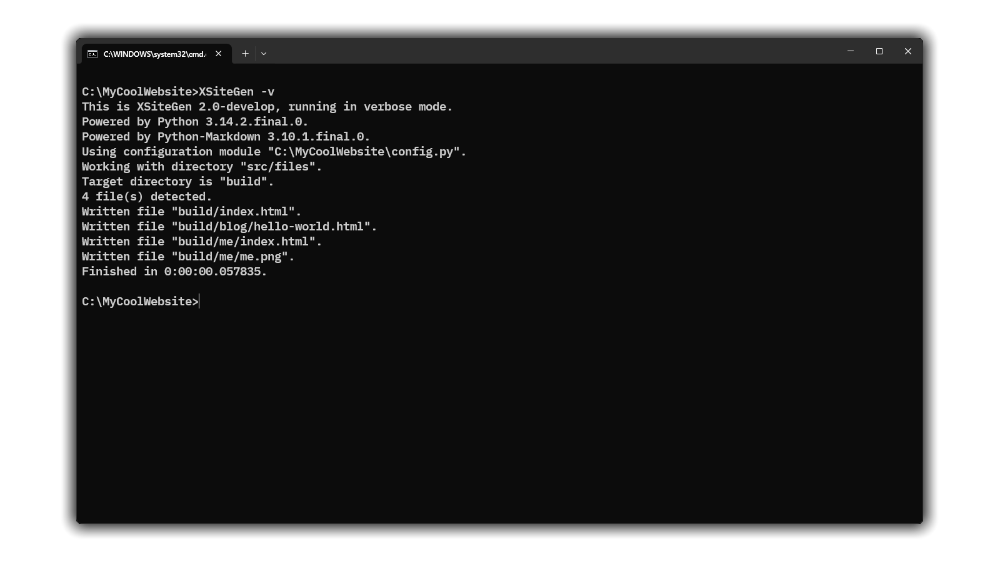

<div align="center">


# XSiteGen 2.0
#### *English &bull; [Русский](README-RU.md)*

</div>

**XSiteGen** is a static site generator developed with a focus on simplicity and minimalism.

The "X" letter in project name stands for "experimental", since the project was started as an experiment, for my personal needs and learning the basic principles of static site generator working.

<div align="center">



</div>

## Contents

- [Installation](#installation)
    - [Dependencies](#dependencies)
    - [Cloning the repository](#cloning-the-repository)
    - [GitHub Releases](#github-releases)
- [Usage](#usage)
    - [Command line](#command-line)
    - [Configuration](#configuration)
    - [Variables](#variables)
    - [Files](#files)
    - [Demo](#demo)
- [History](#history)
- [Contributing](#contributing)
- [Authors](#authors)
- [License](#license)

## Installation

### Dependencies

XSiteGen requires [Python](https://www.python.org) 3.10 (or newer) and [Python-Markdown](https://python-markdown.github.io) library for Markdown text processing. The latest one can be installed using pip package manager:

```
$ pip install markdown
```

> [!WARNING]
>
> **For Windows users:** Windows 8 or newer is required to run Python 3.10 and newer.

### Cloning the repository

Install [Git](https://git-scm.com) if you do not have it installed, then run:

```
$ git clone https://github.com/ivan-movchan/xsitegen
```

After cloning the repository you will be able to easily update XSiteGen by running `git pull` in its directory.

### GitHub Releases

Alternatively, you can obtain XSiteGen from ["Releases"](https://github.com/ivan-movchan/xsitegen/releases) page, where older versions are available also.

## Usage

### Command line

```
$ xsitegen [-hvV]
```

**Commands:**

- `-h`: Show a short help message and exit.
- `-V`: Show program version and exit.

**Options:**

- `-v`: Run in verbose mode.

At startup XSiteGen will immediately load the configuration module and start generating site.

On finishing XSiteGen is able to return one of these exit codes:

- `0`: No errors.
- `1`: Module import error.
- `2`: File operation error.
- `3`: Running Python version is lower than required (see "Installation").
- `42`: XSiteGen was not executed directly but instead imported by other module.

> [!TIP]
>
> You may want to add XSiteGen location to `PATH` environment variable to be able to run XSiteGen from anywhere by simply typing `xsitegen` (or `xsitegen.py`) into console.

> [!CAUTION]
> 
> **For Windows users:** if you are having Python installed through Python install manager, you are strongly recommended to create and use a special Batch file named `xsitegen.bat` containing this command:
>
> ```
> @"PYTHON_INSTALLATION_PATH\python.exe" "XSITEGEN_LOCATION_PATH\xsitegen.py" %*
> ```
> 
> `PYTHON_INSTALLATION_PATH` should be replaced by the directory Python is installed and being run from (i. e. `%localappdata%\Python\pythoncore-3.14-64`), and `XSITEGEN_LOCATION_PATH` should be replaced by the directory XSiteGen is located in (i. e. `C:\XSiteGen`).
> 
> This workaround will not let XSiteGen run in separate window and quickly disappear, making you unable to see the program log. The problem is caused by serious OS changes (regarding on Python install manager developer's [comment](https://github.com/python/pymanager/issues/193#issuecomment-3401904396)) and is not affiliated with XSiteGen.

### Configuration

The configuration is done by editing `config.py` module, which can be loaded from any directory, even different from XSiteGen location.

If XSiteGen fails to find the configuration module, you will have to create it manually. If the configuration module is found but has errors, you will see a short message describing an error occurred while loading the module.

See [xsitegen/default_settings.py](xsitegen/default_settings.py) module for all supported settings.

### Variables

Variables can be defined and used in source files or even other variables. To mention the variable, just write its name in curly brackets. Registry case matters.

```html
<html>
    <head>
        <title>{page-title}</title>
    </head>
    <body>
        <h1>{title}</h1>
        <h4><em>{date}</em></h4>
        {content}
    </body>
</html>
```

**Global variables** are being defined in the configuration module and applied to every source file.

**Directory variables** are being defined in the configuration module too and applied to every source file in specified directories.

**Page variables** are being defined at the beginning of source file and applied to it only.

```
---
title: My website
description: My page description.
date: 1970-01-01
blablabla
---
```

The last variable will be defined as empty, since no value is written after its name.

**Reserved variables:**

- `{content}`: a page content taken from the source file and transformed from Markdown into HTML. **Mandatory to be mentioned in template files.**
- `{datetime}`: a date/time stamp representing the moment when the page has been generated.

### Files

The source files' tree of the site being built with XSiteGen can look like this:

```
/
|-- config.py
|-- build/
|-- src/
    |-- templates/
        |-- template.html
    |-- files/
        |-- index.md
        |-- logo.png
        |-- blog/
            |-- 00-hello-world.md
```

- `config.py` contains all user settings applied to the site.
- `build/` will contain files of the built site ready for production.
- `src/` contains all source files used for building.
    - `src/templates/` contains HTML page template files.
    - `src/files/` contains all source files (and probably extra files). Source files are used for generating HTML pages from them. All other files will be just copied if you allowed it.

### Demo

The [demo](../demo/) directory contains source files of an example site that can be used as a template for your future sites being built with XSiteGen.

## History

See the [CHANGELOG.md](CHANGELOG.md) file for project history and change log.

## Contributing

Report bugs and suggest new ideas using ["Issues"](https://github.com/ivan-movchan/xsitegen/issues) page, or by contacting the developer privately.

You are free to fork the repository (`develop` branch), improve the project and then send a pull request.

Thank you for your interest in XSiteGen.

## Authors

- **Ivan Movchan (@ivan-movchan)**\
  Author and developer.

## License

XSiteGen is free software released under the terms of the MIT License.
See the [LICENSE](LICENSE) file for details.